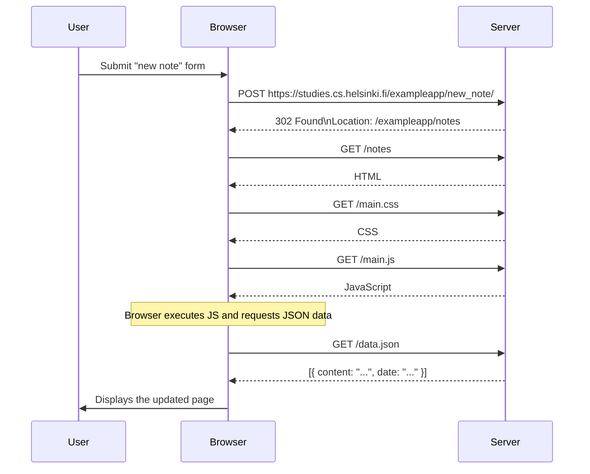

<h1>Sequence diagrams</h1>

A Sequence diagram is an interaction diagram that shows how processes operate with one another and in what order.

<h2>Exercise</h2>

Create a similar diagram that describes the situation in which the user creates a new note on the page https://studies.cs.helsinki.fi/exampleapp/notes by writing something in the text field and clicking on the Save button.

<h2>Solution</h2>

