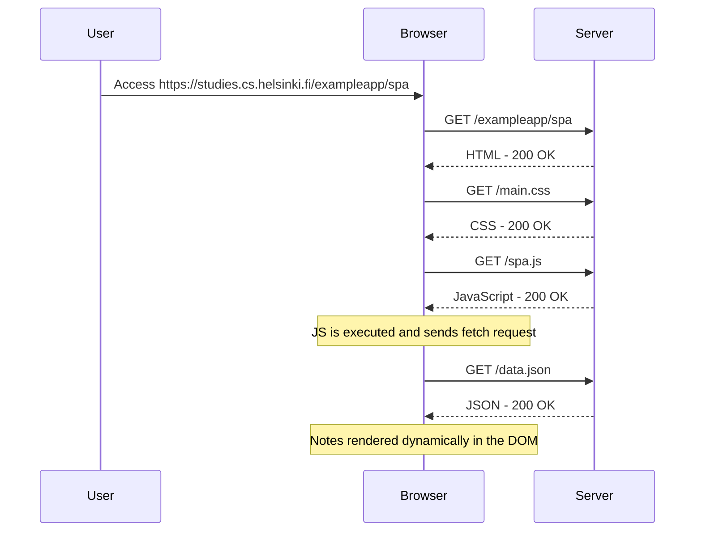

<h1>Single page app diagram</h1>

<h2>Exercise</h2>

Create a diagram depicting the situation where the user goes to the single-page app version of the notes app at https://studies.cs.helsinki.fi/exampleapp/spa.

<h2>Solution</h2>

