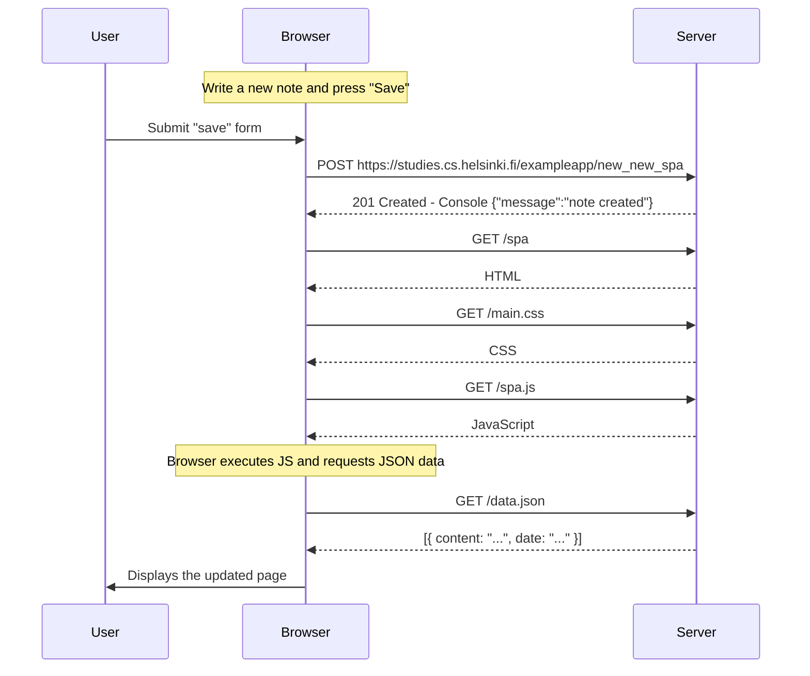

<h1>New note in Single page app diagrams</h1>

<h2>Exercise</h2>

Create a diagram depicting the situation where the user creates a new note using the single-page version of the app.

<h2>Solution</h2>

